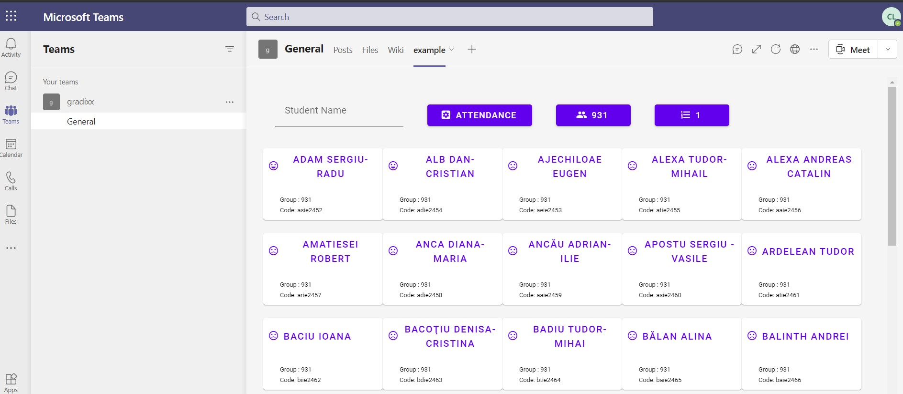
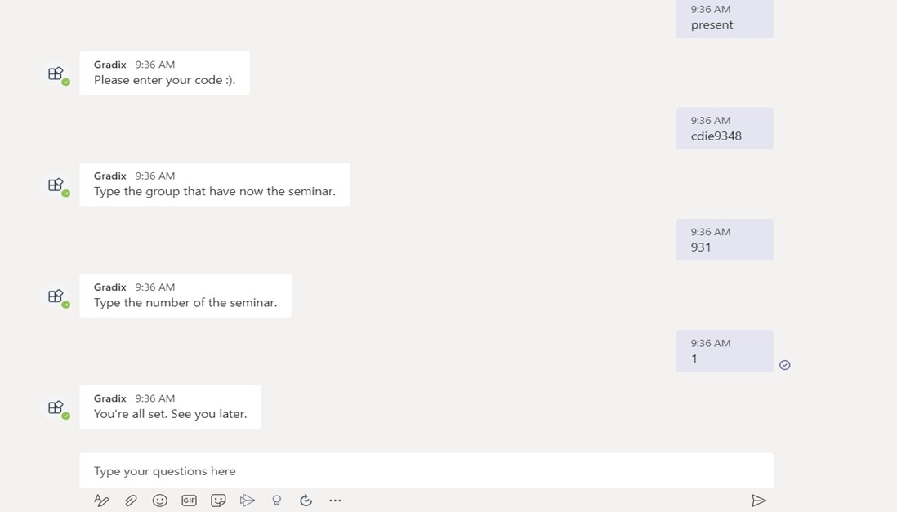

# Gradix

### This project was build for my bachelor dissertation at University Babeș-Bolyai Cluj-Napoca, section: Computer Science

### This application aims to help a teacher with the management of the seminar attendances and activities.
### It uses Haskell for the implementation of the backend server(built with Servant) and Purescript(Halogen) for the frontend part
### The web application is hosted on github pages, and it is rendered inside a Microsoft Teams tab for convenience reasons.

### The user can also chat with a Microsoft Teams bot in order to send messages to the server

